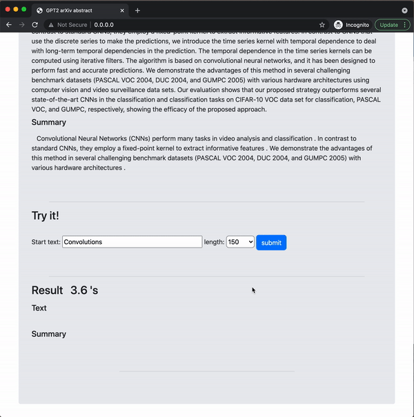

# GPT2-arXiv style text

This project generates arXiv abstract style text and its summary using finetuned GPT-2 model.

model: [Google Drive](https://drive.google.com/file/d/1HIHIXIVdj1SZGgW8PFXxqqL-Pt0FMZa3/view?usp=sharing)
dataset: [Kaggle arXiv](https://www.kaggle.com/Cornell-University/arxiv)

## Docker
    docker build -t arxiv . (build image)

    docker run -p 80:80 --name arxiv -d arxiv (build container)

    docker logs -f arxiv (To check progress)

    Download might take a while. Once completed, server is 
    available at http://localhost, or http://0.0.0.0

    docker rm -f arxiv (To end)

## how to use
    First, Fill text in "text". This will be the base of your abstract. 

    Choose the length of your text. 
    
    Complete!

#### /GPT2-arXiv/

    text: The base text to generate arXiv abstract style text. 
    length: Size of text.

### Output format

#### /GPT2-arXiv/

    [generated_text, summary]
  

  

